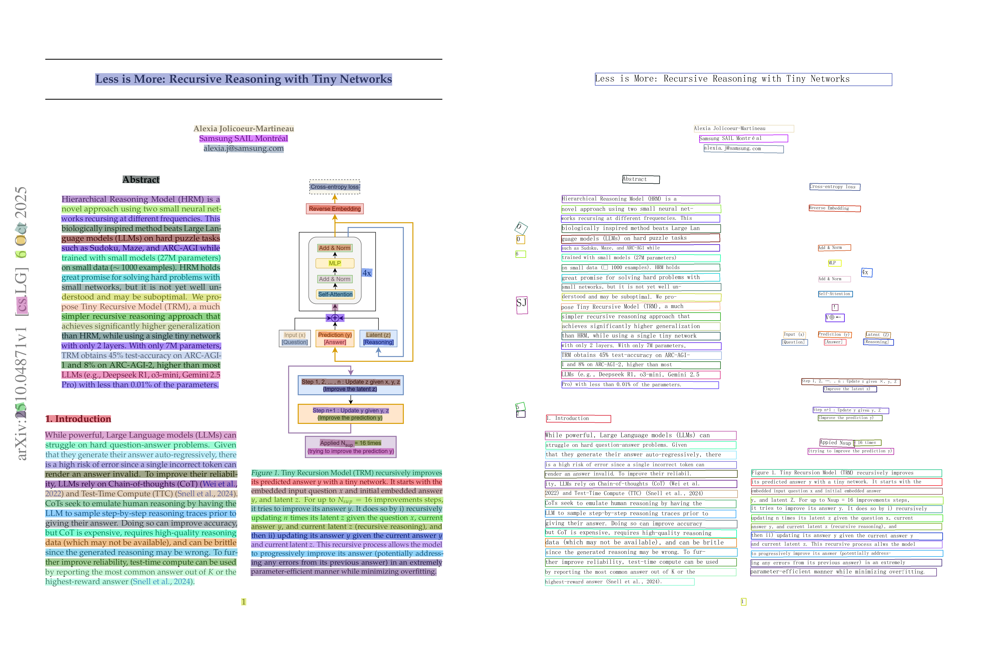

# PP-OCRv5/PP-OCRv6 ONNX (uv-based workflow)

This repo runs PaddleOCR v5 and v6 detection/recognition models exported to ONNX with onnxruntime, using uv for dependency management and execution.

## Recent updates
- **2026-06-24**: feat: Add PP-OCRv6 medium ONNX config presets, v6 dictionary packaging, and independent detector/recognizer mixing
- **2026-05-19**: Include Apache License 2.0
- **2026-02-10**: feat: Add OCR configuration classes and YAML support
- **2026-02-03**: feat: Add OCR text detection and recognition modules
- **2026-01-10**: fix: align detection with official PP-OCRv5 resize & params (#2)
- **2026-01-05**: enhance CTCLabelDecode with softmax and update image resize logic
- **2025-09-25**: feat: add visualization support for OCR results

## Requirements
- Python 3.10+
- uv (https://docs.astral.sh/uv/) – fast Python package/dependency manager

## Install uv
Choose one:

- Via installer:
```sh
curl -LsSf https://astral.sh/uv/install.sh | sh
```
- Or via pipx:
```sh
pipx install uv
```

Ensure `~/.local/bin` (or the path printed by the installer) is on your `PATH`.

## Setup
Sync the environment (installs deps from `pyproject.toml` / `uv.lock`):
```sh
uv sync
```

## Installation

### Option 1: Install from source (recommended for development)
```sh
# Clone the repository
git clone https://github.com/your-username/ppocrv5-onnx.git
cd ppocrv5-onnx

# Install in development mode
pip install -e .
```

### Option 2: Install directly from GitHub
```sh
pip install git+https://github.com/your-username/ppocrv5-onnx.git
```

### Option 3: Using uv (if already in project directory)
```sh
uv sync
uv pip install -e .
```

If you are on a headless server and encounter display issues, you can swap OpenCV with:
```sh
uv remove opencv-python && uv add opencv-python-headless
```

For GPU builds (CUDA), replace onnxruntime with the GPU variant:
```sh
uv remove onnxruntime && uv add onnxruntime-gpu
```

## Configuration
Models and the character dictionary can be configured with either detailed model paths or preset names.

`config.yaml` is a full PP-OCRv5 mobile example:
```yaml
engine:
  model:
    det:
      path: ./models/PP-OCRv5_mobile_det/inference.onnx
      # resize_long: resize image so that the longer side equals this value (keeps aspect ratio)
      resize_long: 960 
      # PostProcess parameters (aligned with official PP-OCRv5 config)
      thresh: 0.3
      box_thresh: 0.6
      unclip_ratio: 1.5
      max_candidates: 1000
    rec:
      path: ./models/PP-OCRv5_mobile_rec/inference.onnx
      input_shape: [3, 32, 320]
      dict_path: ./ppocrv5_onnx/data/dict/ppocrv5_dict.txt
visualize:
  font_path: ppocrv5_onnx/data/fonts/simfang.ttf
  save_dir: output
  box_thickness: 2
```
`config_ppocrv6.yaml` is a full PP-OCRv6 medium example:
```yaml
engine:
  model:
    det:
      path: ./model/PP-OCRv6_medium_det_onnx/inference.onnx
      resize_long: 960
      thresh: 0.2
      box_thresh: 0.45
      unclip_ratio: 1.4
      max_candidates: 3000
    rec:
      path: ./model/PP-OCRv6_medium_rec_onnx/inference.onnx
      input_shape: [3, 48, 320]
      dict_path: ./ppocrv5_onnx/data/dict/ppocrv6_dict.txt
```

You can also mix detector and recognizer presets with a compact YAML:
```yaml
engine:
  det_model: ppocrv5_mobile
  rec_model: ppocrv6_medium
```

Detailed `engine.model.det` and `engine.model.rec` blocks override preset values when both are present. `resize_long` is used instead of a fixed detector `input_shape` to match official PaddleOCR behavior and prevent image distortion.

Supported preset names (all auto-download from [GitHub Releases](https://github.com/HoVDuc/ppocrv5-onnx/releases)):

| Detector / Recognizer preset | Release asset |
|---|---|
| `mobile` / `ppocrv5_mobile` | `PP-OCRv5_mobile_{det,rec}.zip` |
| `server` / `ppocrv5_server` | `PP-OCRv5_server_{det,rec}.zip` |
| `ppocrv6_medium` | `PP-OCRv6_medium_{det,rec}_onnx.zip` |
| `ppocrv6_small` | `PP-OCRv6_small_{det,rec}_onnx.zip` |
| `ppocrv6_tiny` | `PP-OCRv6_tiny_{det,rec}_onnx.zip` |

Preset defaults are loaded from the `inference.yml` bundled inside each release zip. Recognition dictionaries are materialized once as `character_dict.txt` next to the ONNX model. Packaged `ppocrv5_dict.txt` / `ppocrv6_dict.txt` remain available for manual `from_model_paths()` usage.

## Usage

### Quick Start (Recommended)

```python
from ppocrv5_onnx import OCRPipeline

# Method 1: From pretrained config (auto-downloads models)
pipeline = OCRPipeline.from_pretrained()

# PP-OCRv6 medium preset
pipeline = OCRPipeline.from_pretrained("ppocrv6_medium")

# Method 2: From YAML config file
pipeline = OCRPipeline.from_config("config.yaml")

# Run OCR
results = pipeline("path/to/image.jpg")
for r in results:
    print(f"Text: {r.text}, Score: {r.score:.3f}")
```

### Advanced Usage

```python
from ppocrv5_onnx import OCRPipeline, OCRConfig, DetectorConfig, RecognizerConfig

# Method 3: Custom config object
config = OCRConfig(
    det=DetectorConfig(path="./models/PP-OCRv5_mobile_det/inference.onnx"),
    rec=RecognizerConfig(
        path="./models/PP-OCRv5_mobile_rec/inference.onnx",
        dict_path="./ppocrv5_onnx/data/dict/ppocrv5_dict.txt"
    )
)
pipeline = OCRPipeline(config)

# Method 4: Direct model paths
pipeline = OCRPipeline.from_model_paths(
    det_model_path="./models/PP-OCRv5_mobile_det/inference.onnx",
    rec_model_path="./models/PP-OCRv5_mobile_rec/inference.onnx",
    dict_path="./ppocrv5_onnx/data/dict/ppocrv5_dict.txt"
)

# Method 5: Mix detector and recognizer presets independently
pipeline = OCRPipeline.from_pretrained(
    det_model="ppocrv5_mobile",
    rec_model="ppocrv6_medium",
)

pipeline = OCRPipeline.from_mix("ppocrv5_mobile", "ppocrv6_medium")

# With GPU support
pipeline = OCRPipeline.from_pretrained(
    "mobile",
    det_providers=["CUDAExecutionProvider"],
    rec_providers=["CUDAExecutionProvider"]
)

# Enable visualization (saves result to output folder)
pipeline = OCRPipeline.from_config("config.yaml", visualize=True)
results = pipeline("path/to/image.jpg")
```

### PP-OCRv6 Notes

PP-OCRv6 medium recognition uses `input_shape=[3, 48, 320]` and `ppocrv6_dict.txt`. `OCRPipeline.from_model_paths()` detects v6 recognizer paths and defaults to these values when `dict_path` and `input_shape` are not provided.

Model `.onnx` files are not committed to this repository. Use `from_pretrained()` after release assets are available, or point YAML/direct-path config at local ONNX files such as:
- `model/PP-OCRv6_medium_det_onnx/inference.onnx`
- `model/PP-OCRv6_medium_rec_onnx/inference.onnx`

### Using Individual Components

```python
from ppocrv5_onnx import Detector, Recognizer
from ppocrv5_onnx.utils import load_config

cfg = load_config('config.yaml')

# Detection only
detector = Detector(cfg.engine.model.det)
boxes = detector.detect(image)

# Recognition only  
recognizer = Recognizer(cfg.engine.model.rec)
texts = recognizer.recognize(cropped_images)
```

## Demo



## Common uv commands
- Install/sync env from lockfile: `uv sync`
- Add/remove a package: `uv add <pkg>`, `uv remove <pkg>`
- Run a script in the project env: `uv run <cmd>`

## Project Structure
```
ppocrv5-onnx/
├── config.yaml              # Configuration file
├── config_ppocrv6.yaml      # Local PP-OCRv6 medium path example
├── config_mix_v5det_v6rec.yaml
├── pyproject.toml           # Project dependencies
├── ppocrv5_onnx/
│   ├── __init__.py          # Exports: OCRPipeline, Detector, Recognizer, etc.
│   ├── pipeline.py          # Main OCRPipeline class
│   ├── schema.py            # OCRResult dataclass
│   ├── utils.py             # Config utilities
│   ├── data/
│   │   ├── dict/ppocrv5_dict.txt
│   │   ├── dict/ppocrv6_dict.txt
│   │   └── fonts/simfang.ttf
│   ├── text_detector/
│   │   ├── detector.py      # Detector class
│   │   ├── preprocess.py
│   │   ├── postprocess.py
│   │   └── crop_poly.py
│   ├── text_recognizer/
│   │   ├── recognizer.py    # Recognizer class
│   │   ├── preprocess.py
│   │   └── postprocess.py
│   └── tools/
│       └── visualizer.py    # OCRVisualizer
├── models/                  # Download/cache location for preset models
│   ├── PP-OCRv5_mobile_det/inference.onnx
│   ├── PP-OCRv5_mobile_rec/inference.onnx
│   ├── PP-OCRv6_medium_det/inference.onnx
│   └── PP-OCRv6_medium_rec/inference.onnx
├── model/                   # Optional local dev model paths, gitignored
│   ├── PP-OCRv6_medium_det_onnx/inference.onnx
│   └── PP-OCRv6_medium_rec_onnx/inference.onnx
└── img/
```

## Model export (Paddle2ONNX)
Clone the PaddleOCR repo if you haven't already:
```sh
git clone https://github.com/PaddlePaddle/PaddleOCR.git
```

Step 1
Export model to inference format using PaddlePaddle tools. Example for recognize model:
```sh
cd PaddleOCR
python3 tools/export_model.py -c=configs/rec/PP-OCRv5/PP-OCRv5_server_rec.yml -o \
        Global.pretrained_model=/path/PP-OCRv5_server_rec_pretrained.pdparams \
        Global.save_inference_dir=./PP-OCRv5_server_rec/
```

Step 2
Convert the exported model to ONNX format using `paddle2onnx`. Example command:
```sh
paddle2onnx --model_dir /path/PP-OCRv5_server_rec_infer \
--model_filename inference.json \
--params_filename inference.pdiparams \
--save_file model.onnx \
--opset_version 17 \
--enable_onnx_checker True
```


## Troubleshooting
- Missing dependency? `uv add <name>` and re-run `uv sync`.
- Path errors for models/dict? Verify the paths in `config.yaml`, `config_ppocrv6.yaml`, or your custom config are correct relative to the repo root.
- `IndexError` during recognition decode usually means the recognizer dictionary does not match the recognizer ONNX model. Use `ppocrv6_dict.txt` with PP-OCRv6 medium recognition.
- `from_pretrained("ppocrv6_medium")` requires PP-OCRv6 release zip assets to be available. Until those assets are published, use `config_ppocrv6.yaml` or `from_model_paths()` with local ONNX files.
- OpenCV display errors on servers? Use `opencv-python-headless`.
- GPU not used? Ensure CUDA drivers/runtime are installed and use GPU providers:
  ```python
  pipeline = OCRPipeline.from_config(
      "config.yaml",
      det_providers=["CUDAExecutionProvider"],
      rec_providers=["CUDAExecutionProvider"]
  )
  ```

## License

This project uses and adapts components/concepts from PaddleOCR, which is licensed under the Apache License 2.0.

Third-party models, fonts, dictionaries, and upstream assets retain their original licenses.
